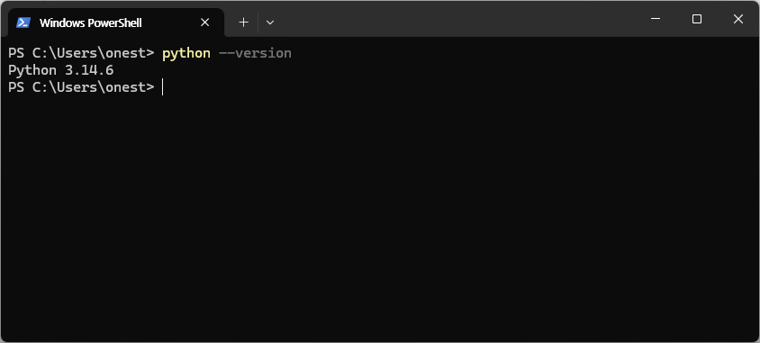
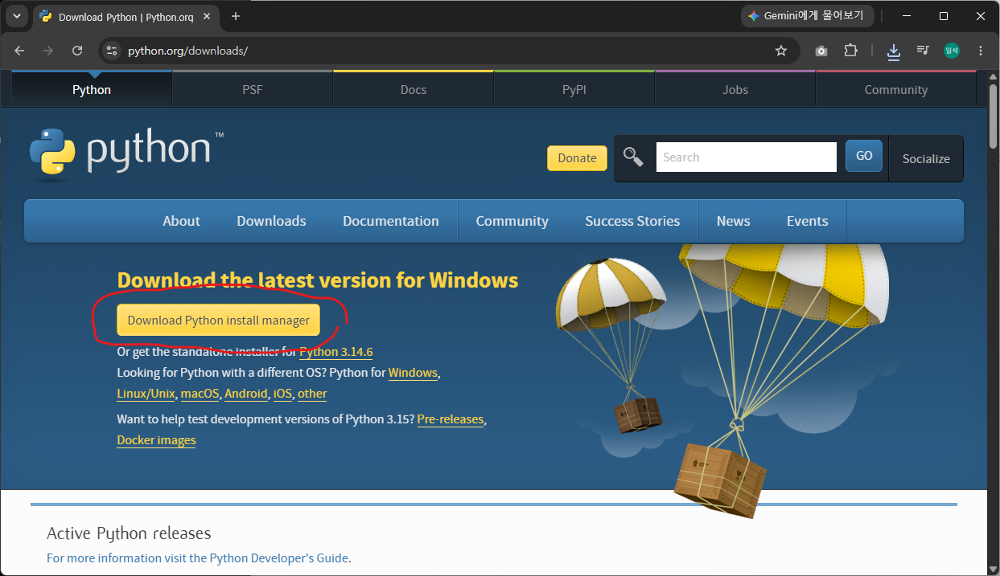
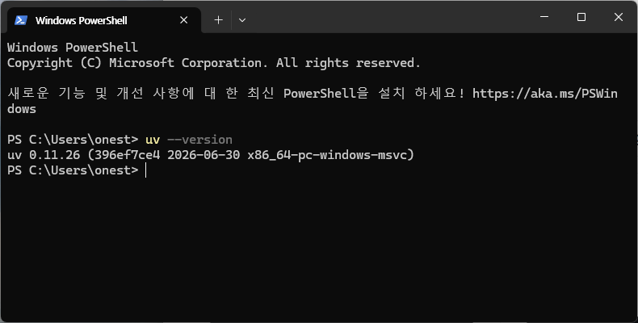
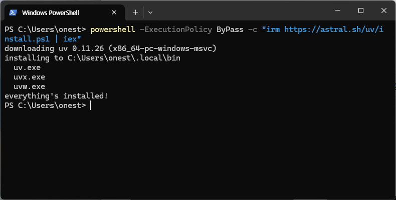
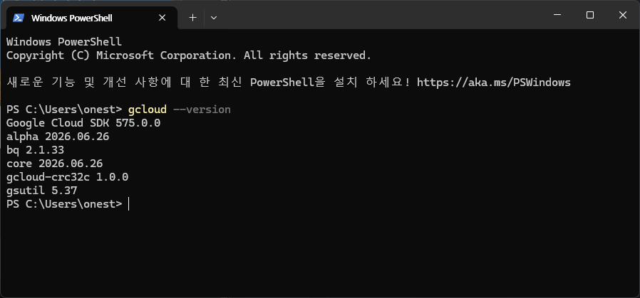
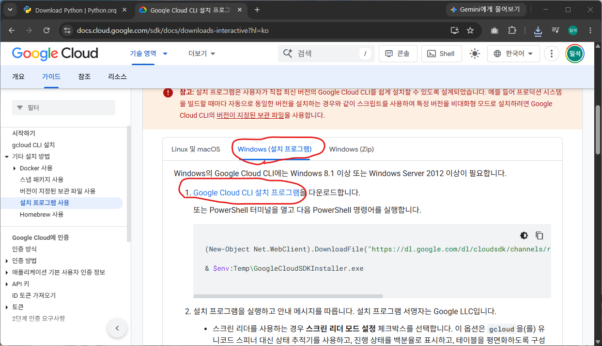
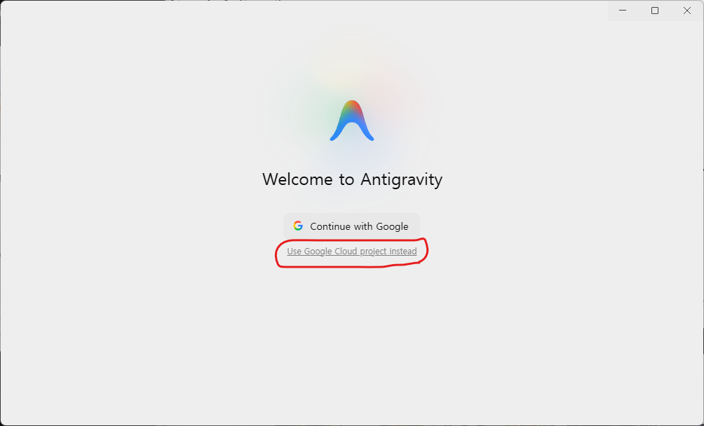
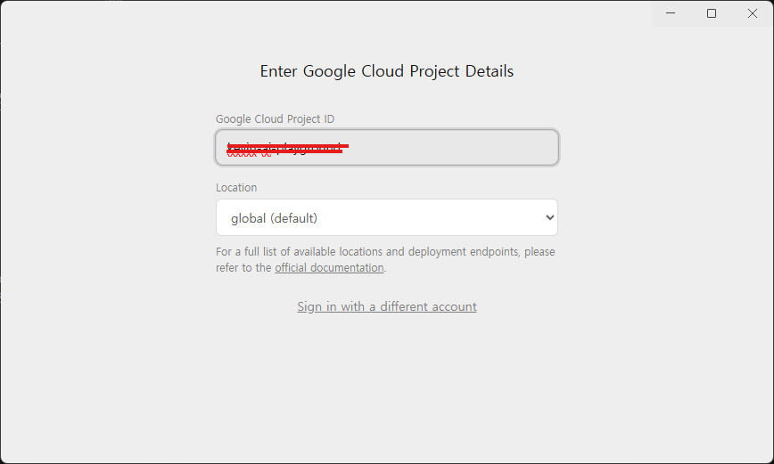
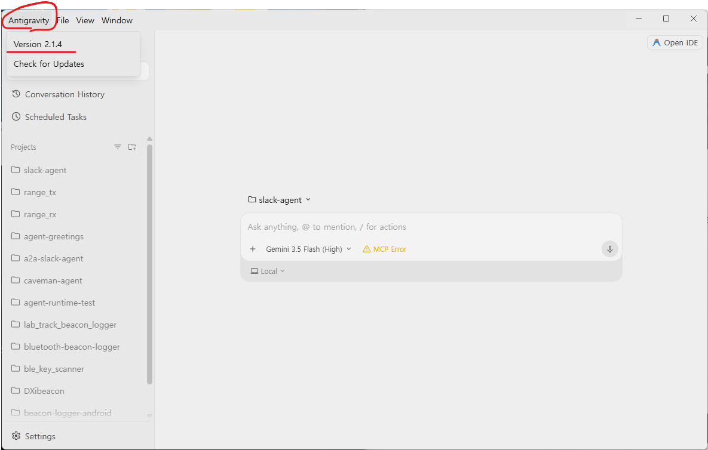

# 사전준비

Antigravity의 실행 환경은 결국 사용자의 로컬환경(PC, Mac)입니다. 로컬에서 Antigravity가 움직이려면 도구가 필요합니다. 코드를 실행, Google Cloud 작업, 커멘드 라인 작업 등 **실습에 필요한 아래 도구들을 실습전에 설치해 오시면 시간을 아낄 수 있습니다**. 설치가 되었는지 확인해보고 설치되어있다면 넘어가도 됩니다. 

Windows PC 기준으로 설명합니다. 

설치내용
* [Python 설치](#python-설치)
* [UV 설치](#uv-설치)
* [gCloud 설치](#gcloud-설치)
* [Antigravity 2.0 설치](#antigravity-20-설치)
* [agents-cli 설치](#agents-cli-설치)

## Python 설치

실습은 Python 코드로 진행됩니다. 

### 설치확인 

Windows Terminal 을 열고 아래 명령을 입력하여 설치를 확인 합니다. 
```
python --version
```



### 설치 

[Python Download 페이지](https://www.python.org/downloads/)에서 **Donwload Python install manager** 를 다운로드 받아서 설치합니다. 설치가 잘 되었는지 확인합니다. 현재 최신 3.14.6 




## UV 설치 

Python 패키지 매니저인 uv 를 설치합니다. 

### 확인 

```
uv --version
```



### 설치 

아래 명령을 Windows Terminal 에서 실행합니다. PowerShell 터미널이야야 합니다. 

```
powershell -ExecutionPolicy ByPass -c "irm https://astral.sh/uv/install.ps1 | iex"
```



## gCloud 설치 

### 설치확인 

```
gcloud --version
```



만약 설치되어 있다면 update 해줍니다. (optional)

```
gcloud components update
```

### 설치

Google Cloud 에 배포하고 테스트하기 위하여 Google Cloud의 CLI를 설치합니다. 

[Google Cloud CLI 설치 프로그램 사용](https://docs.cloud.google.com/sdk/docs/downloads-interactive?hl=ko) 페이지에 접속하여 installer를 다운로드 합니다. 설치합니다. 



## Antigravity 2.0 설치 

### 확인 

Windows 시작메뉴에서 Antigravity를 입력하여 설치가 되어 있는지 확인 합니다. 실행 후 "Use Google Cloud project instead"를 선택하여 아래 정보를 이용해서 로그인 해주세요. ~~Continue with Google 은 개인 계정과 연결되니 사용하지말아주세요.~~

 * 사용 ID: <사번>@hankooktech.com
 * Project ID: hk-hands-on
 * Location: global







Antigravity 2.0 에서 사용할 Skills, MCP를 큰 카테고리로 설정합니다. **Science 빼고 모두 선택**


### 설치

[Download Google Antigravity for WindowsDownload Google Antigravity for Windows](https://antigravity.google/download)페이지에서 "Download for x64"를 클릭하여 다운로드 합니다. 


## agents-cli 설치

ADK(Agent Development Kit)을 사용하여 Agent 를 만들때 Skills 를 사용하여 정확한 코드를 생성하기 위해 설치합니다. 

### 설치

Windows Terminal을 열어서 아래 명령을 실행합니다 .

```
uvx google-agents-cli setup
```


