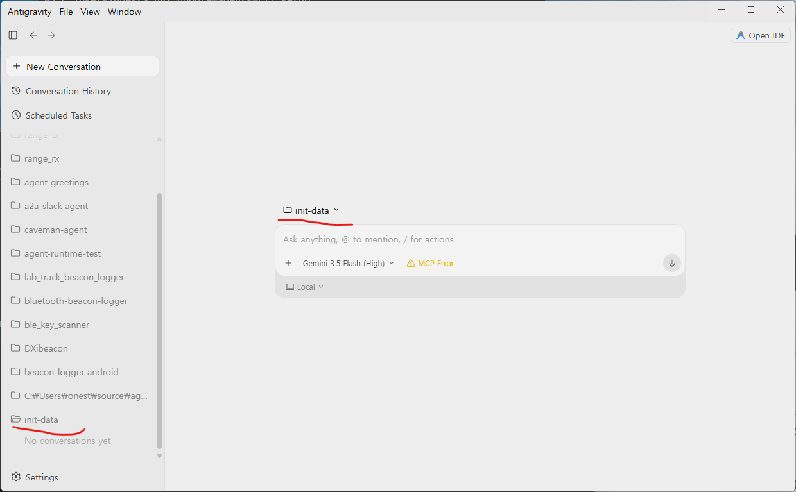
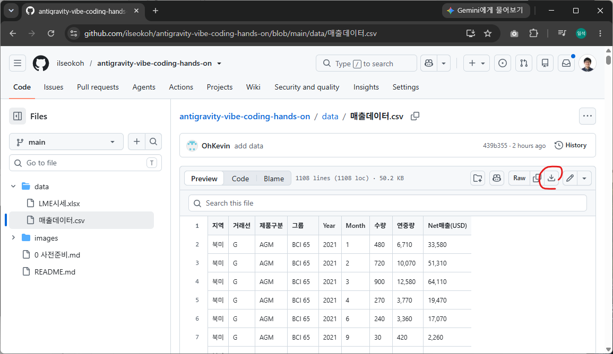
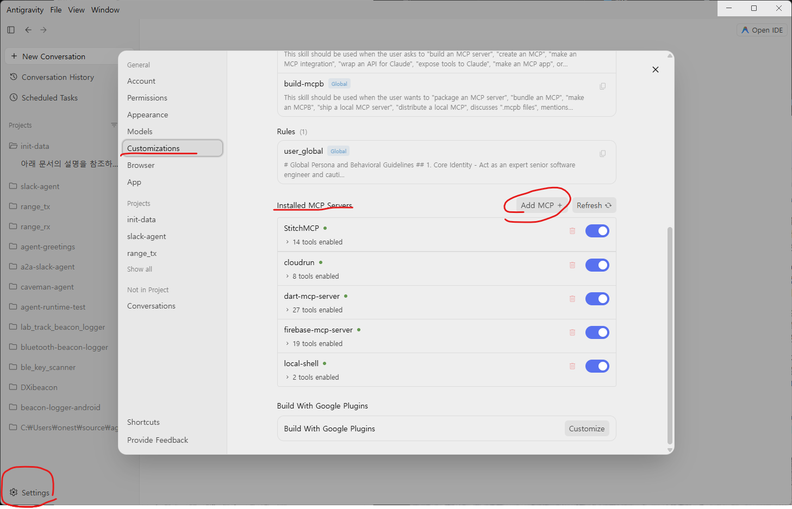
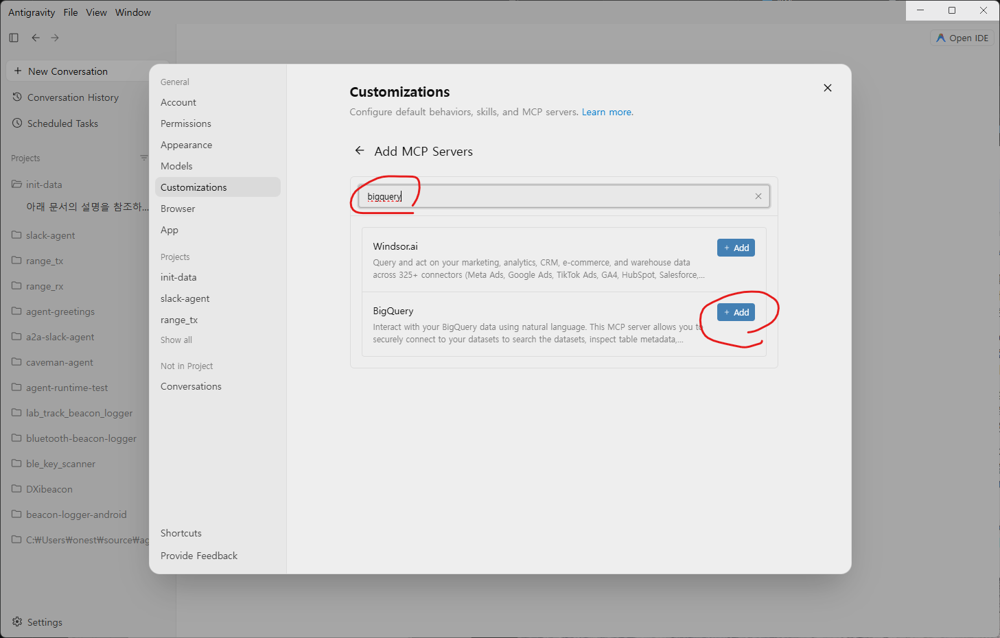
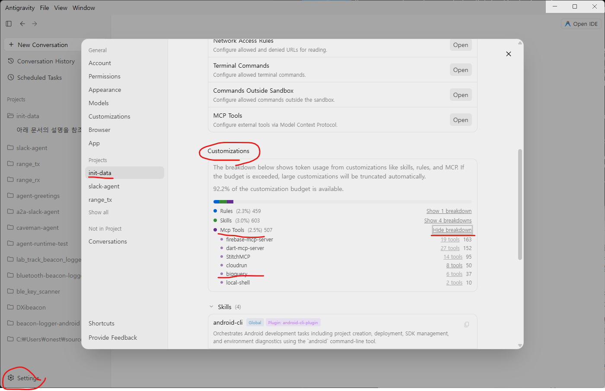
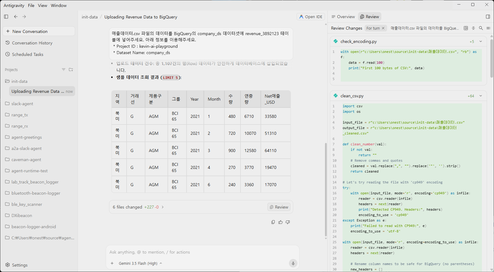

# 매출데이터로 데이터베이스 만들기 

[매출데이터 CSV 파일](./data/매출데이터.csv)은 지역, 거래선별 2021년부터 2025년까지의 매출데이터 입니다. 이 데이터로 Conversational Analytics Agent를 만들어 볼 예정입니다. Data에 기반하여 정확한 답변과 정리된 테이블 차트를 만들어 답변할 수 있습니다. 이를 위해 첫번째 단계는 데이터를 조회가능하도록 데이터베이스에 넣어야 합니다. 여기서 사용할 데이터베이스는 Google Cloud의 BigQuery입니다. 

Antigravity는 코드를 생성하고 실행해서 테이블을 만들고 CSV 포맷의 데이터를 Insert 합니다. 

## 실습 순서 

 1. [1 실습1 데이터베이스 구축](./1%20실습1%20데이터베이스%20구축.md)
 1. [2 실습2 Conversational Analytics Agent 만들기](./2%20실습2%20Conversational%20Analytics%20Agent%20만들기.md)
 1. [3 실습3 ADK 납시세 조회 에이전트 만들기](./3%20실습3%20ADK%20납시세%20조회%20에이전트%20만들기.md)
 1. [4 실습4 매출분석 에이전트 연동](./4%20실습4%20매출분석%20에이전트%20연동.md)
 1. [5 실습5 Agent 배포하기](./5%20실습5%20Agent%20배포하기.md) (**Optional**)

## 1. Antigravity 2.0 실행 

Antigravity 2.0을 실행하고 Login 합니다. 아직 설치가 안되어 있다면 [0 사전준비](./0%20사전준비.md)의 내용을 보고 설치해주세요. 


## 2. New Project 

로컬 PC에 **새폴더**를 만들고 지정하여 **init-data**이라는 이름으로 새 프로젝트를 만듭니다. **Security Settings** 는 Default 로 설정합니다. 





## 3. 매출 데이터 다운로드

매출 데이터를 다운로드 받아 **새로만든 폴더에 복사**합니다. 

[매출데이터](https://github.com/ilseokoh/antigravity-vibe-coding-hands-on/blob/main/data/%EB%A7%A4%EC%B6%9C%EB%8D%B0%EC%9D%B4%ED%84%B0.csv) 페이지에서 오늘쪽 위 다운로드 (download raw file) 버튼을 클릭




## 4. 터미널에서 Google Cloud 로그인 

Windows Terminal을 열어서 아래 2가지 명령을 **각각** 입력하여 Google Cloud에 로그인 합니다. 브라우저가 자동으로 열립니다. 

```
gcloud auth login
```

```
gcloud auth application-default login
```

```
gcloud config set project [Google Cloud 프로젝트 ID]
```

## 5. BigQuery Remote MCP Server 설치 

Antigravity 2.0이 수월하게 BigQuery 작업을 할 수 있도록 BigQuery Remote MCP Server 설치합니다.

### 설정에서 +Add MCP 버튼을 클릭합니다. 



### bigquery 로 검색하여 install 버튼을 클릭 합니다. 



### 설치를 확인 합니다. 



## 5. Antigravity 2.0 테이블 생성 및 데이터 입력 

 * Project ID : 
 * BigQuery 라는 데이터베이스를 사용합니다. 
 * Dataset Name: company_ds
 * Table Name: revenue_[구분을 위한 아이디]


 > **Warning**
 > 테이블이름은 다른 분들과 겹치지 않도록 _사번 같은 구분자를 붙여주세요. 

Antigravity 2.0에서 이제 적절한 Prompt를 입력하여 실행합니다. 

우리가 하려는 작업을 명확히 설명하고 Project ID와 테이블이 생성될 Dataset도 명시해줍니다. 우리는 CSV 파일의 데이터를 [project id] 의 company_ds에 revenue_294983834 테이블에 import 하려는 내용을 명시해줍니다. 

아래 **⏵예제 펼치기**를 누르기 전에 직접 명령을 입력하여 실행해주세요. 

 * 메모장에 먼저 작성을 하는 것도 좋은 방법입니다. 
 * Antigravity 에 직접 입력할 때는 Shift + Enter 로 줄바꿈을 합니다. 
 * Antigravity 2.0은 먼저 Implementation Plan을 작성하기도 합니다. 
 * Plan을 확인하고 Preceed 시킵니다.
 * 무작정 Submit 버튼을 누르기 보다는 어떤작업을 하는지 실펴봅니다. 
 * 사용할 만한 Skills/Tools 를 찾기도 합니다. 
 * Antigravity 2.0 이 중간에 자주 확인을 요청할 수 있습니다. 적절한 Action을 취해주세요. 
 * Google Cloud 내가 가진 권한으로 테이블 생성등의 작업을 하려면 로그인이 필요합니다. 그 명령은 이런식인데 Antigravity 2.0 이 요청할 수 있습니다. "gcloud auth application-default login"


<details>
<summary>예제 펼치기</summary>

```
매출데이터.csv 파일의 데이터를 BigQuery의 company_ds 데이터셋에 revenue_3892123 테이블에 넣어주세요. 아래 정보를 이용해주세요. 
 * Project ID : [Google Cloud Project ID]
 * Dataset Name: company_ds
 * Table Name: revenue_3892123
```



실행결과를 보니 Antigravity가 Python 코드를 작성하여 작업을 실행하고 최종 확인까지 마쳤습니다. 

</details>

## 7. 정리 

첫번째 실습에서는 Antigravity로 데이터를 BigQuery 테이블에 넣었습니다. Antigravity 2.0 이 작업을 잘 할 수 있도록 Google Cloud에 로그인을 해서 Google Cloud 리소스에 접근 가능하도록 했습니다. BigQuery 작업이 수월하도록 BigQuery Remote MCP Server를 설치하여 BigQuery 작업이 원활히 수행되었습니다. 

요즘 회자되고 있는 **하네스(Harness)** 는 BigQuery Remote MCP 서버와 같이 코딩AI가 사용할 적절한 도구를 설정해주는 것입니다. 

다음 과제는 Google Cloud 콘솔에서 코드 없이 Conversational Analytics Agent를 만들어보겠습니다. 

[다음으로 이동](./2%20Conversational%20Analytics%20Agent%20만들기.md)
