# 매출데이터의 대화형 분석 에이전트 만들기 

이번 실습은 코딩은 아니고 Google Cloud 콘솔 화면에서 코드 없이 "매출데이터의 대화형 분석 에이전트"를 만들어보겠습니다. [실습 1 데이터베이스 구축](./1%20실습1%20데이터베이스%20구축.md)을 통해 매출데이터가 BigQuery 테이블에 올라가 있습니다. BigQuery의 Coversational Analytics Agent를 활용하여 이 데이터를 분석하는 에이전트를 만들어 보겠습니다. 

Coversational Analytics Agent 는 A2A(Agent to Agent) 프로토콜을 구현한 에이전트가 만들어 집니다. 이 A2A 에이전트는 다른 에이전트에서 호출하여 멀티에이전트를 구현하기 쉽습니다. 


## Google Cloud 콘솔 접속하기 

웹브라우저에서 [Google Cloud 콘솔](https://console.cloud.google.com/)에 접속하고 필요하면 로그인을 합니다. 

Google Cloud 프로젝트가 선택되어 있는지 확인 합니다. 없다면 클릭하여 선택합니다. 

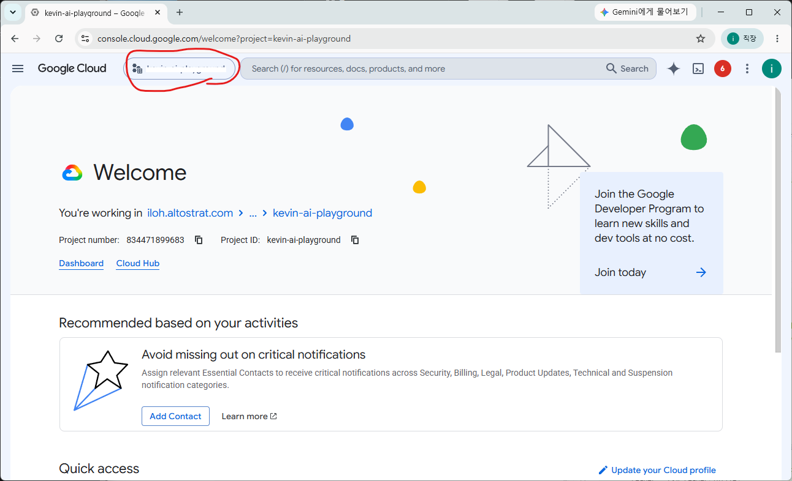

### BigQuery 메뉴로 이동합니다. 

콘솔 화면 상단의 가운데 검색 창에 Bigquery를 입력하여 BigQuery 메뉴를 찾아서 클릭합니다. 

Studio 메뉴에서 실습 1에서 만든 Table 이 있는지 확인 합니다. 

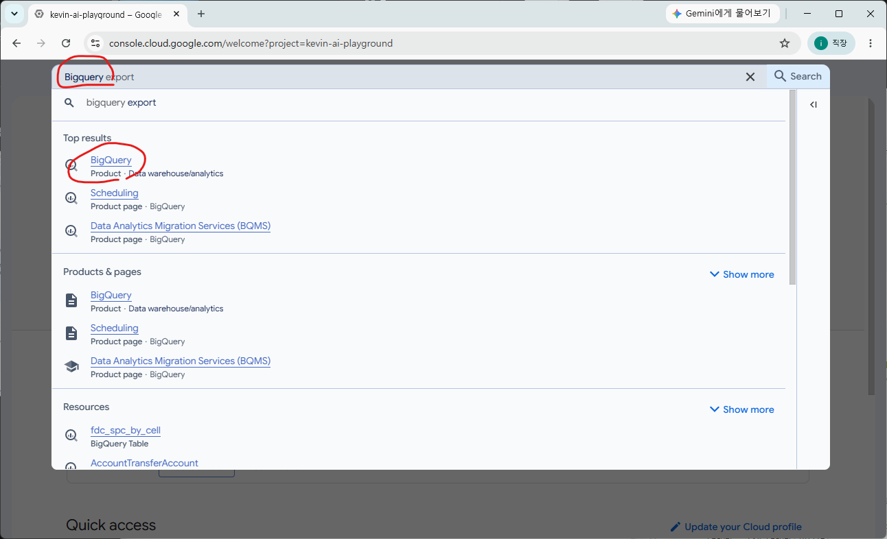

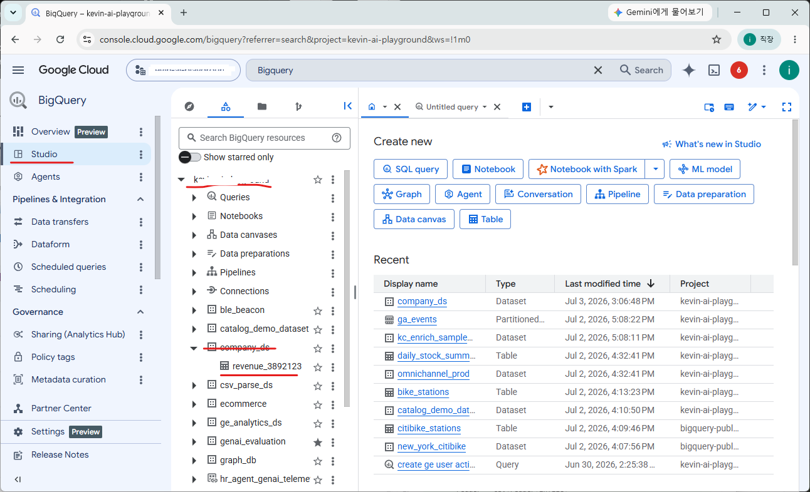

## Knowledge 카달로그 만들기 

Agent에게 Context 정보를 주는 것은 매우 중요합니다. 데이터에 대한 설명, 컬럼에 대한 설명을 정확히 해주면 더 좋은 결과를 만들어 낼 수 있습니다. 테이블 설명, 컬럼 설명을 사람이 직접 입력하는 것은 더 좋은 방법입니다. 하지만 이 조차 Gemini 에 의지를 해서 테이블 설명, 컬럼 설명, 그리고 **Golden Query**까지 한번에 생성하겠습니다. 

Golden Query 는 예제 질문과 그에 따른 Query 문 입니다. Gemini 에게 예제로 입력되는데 이를 참조로 더 정확한 Query를 작성할 수 있습니다. 보통은 평소에 데이터 분서가들이 사용하는 질문과 쿼리를 사용해야겠지만 여기서는 Gemini가 스스로 만들어주는 걸 써보겠습니다. 

### 실습 1에서 생성한 revenue 테이블에서 Insight 생성

테이블을 선택하고 "Insights" 탭으로 이동 합니다. 

"Generate and Public" 버튼을 클릭합니다. 

 * Region: us-central1

Gemini 가 테이블의 스키마와 데이터를 보고 "테이블 설명, 컬럼설명, Golden Query"를 생성해 냅니다. 2-3분 시간이 걸릴수 있습니다. 

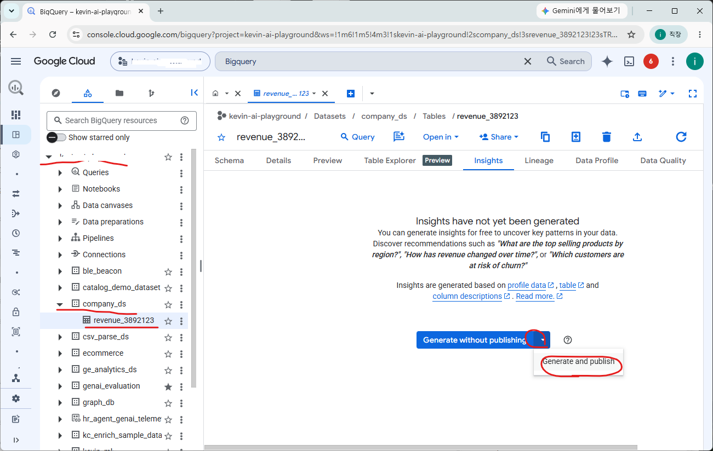

Gemini 가 생성한 내용이 정확한 지 확인 합니다. 

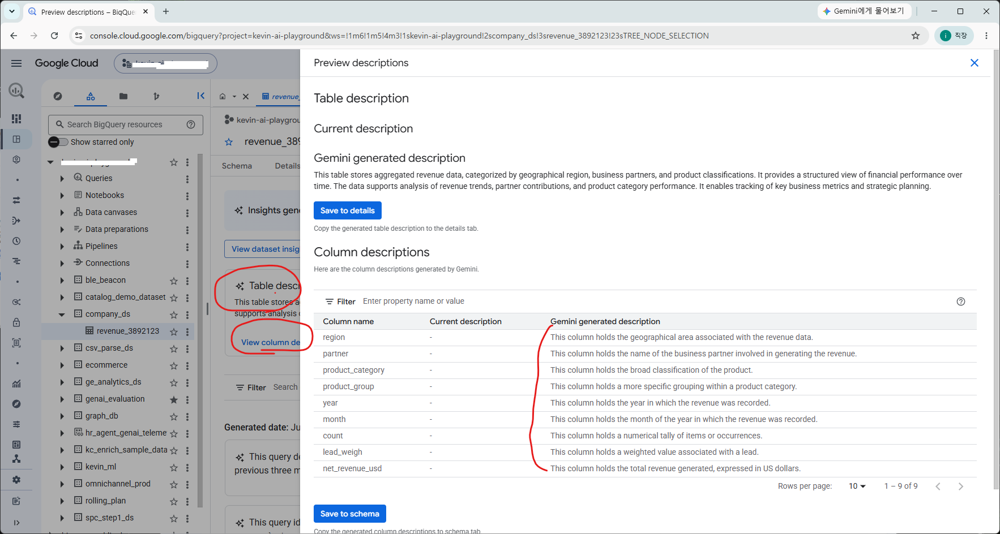

### Agents 메뉴로 이동합니다. 

Agents 메뉴로 이동해서 New Agent 를 클릭합니다. 

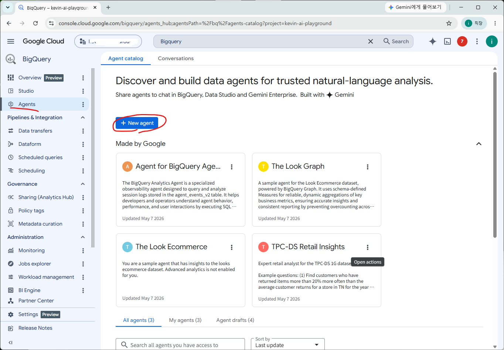

에이전트의 이름과 설명을 입력합니다. 이름과 설명은 항상 중요합니다. 다른 에이전트가 이 에이전트를 호출하려면 어떤 에이전트인지 정확히 알아야 하기 때문입니다. 

 * Agent name: 매출분석 에이전트
 * Agent description: 2021년 부터 2025년까지의 매출에 대한 분석을 위한 에이전트

Knowledge sources 에서 "Add source"를 선택합니다. 

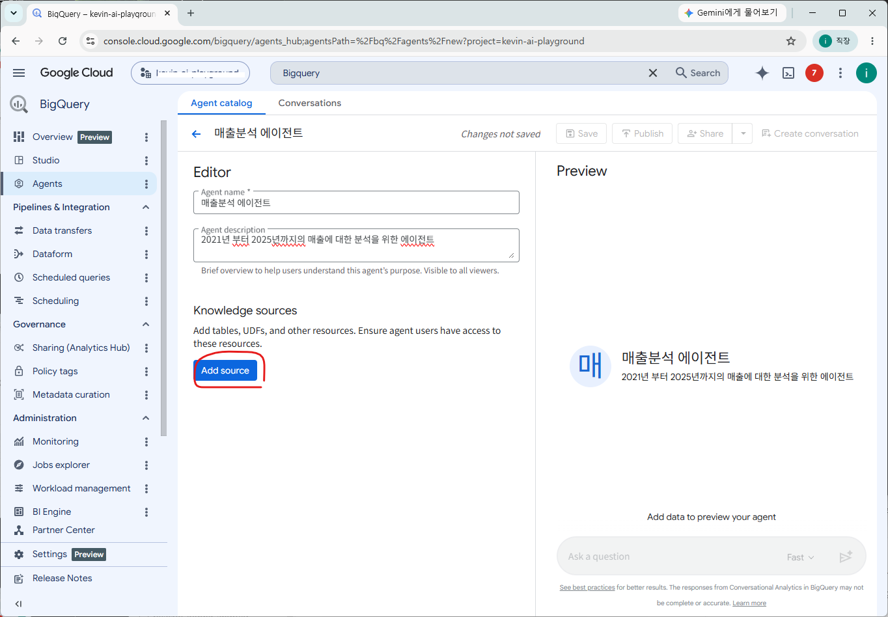

revenue로 검색하여 매출정보가 있는 테이블을 선택합니다. "Add"를 클릭합니다. 

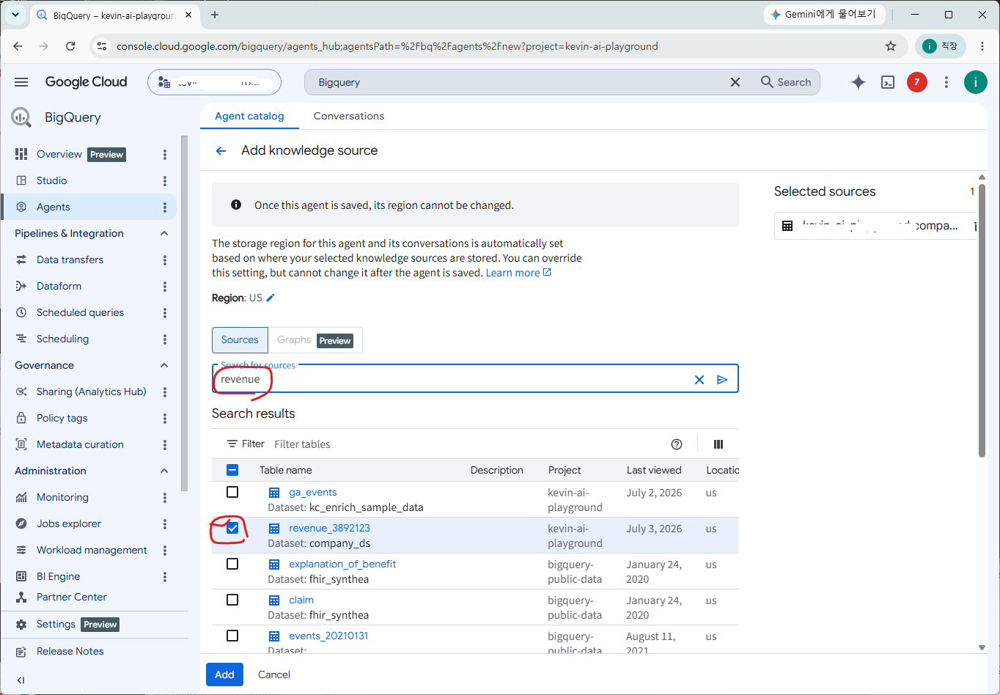

### Instruction 

Gemini에게 지시할 내용을 입력합니다. 데이터에 대한 추가적인 설명이나 상황에 따른 필터링 조건 등 데이터를 조회할 때 참조할 내용입니다. Gemini 가 호출 될 때 항상 추가 되는 내용입니다. 

```
* Revenue의 단위는 USD 입니다. 
* partner는 판매 총판을 의미합니다. 
* count는 판매 수량의 의미합니다. 
* 제품은 납(Pb)의 주요 재료로 사용되며 납의 가격 변동은 매출과 이익에 큰 영향을 줍니다. 
```

### Verified Queries 

Gemini 에게 Example을 주면 더 정확한 데이터를 조회할 수 있습니다. 여기에서는 Gemini 가 생성해준 쿼리를 모두 포함하여 사용하겠습니다. 

"View Gemini-gernerated suggestions" 버튼을 누르고 **모든 쿼리**를 선택하여 포함 시킵니다. 

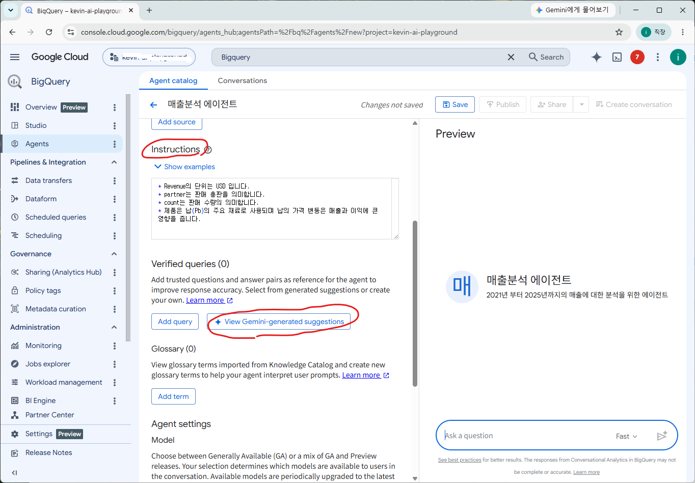

### Terms

Glossary (용어집)을 포함시키면 사용자의 질문을 더 정확하게 이해할 수 있습니다. 연중량에 대한 설명을 추가해보겠습니다. 

```
Terms: 연중량
Definition: 제품생산에 사용한 납(Pb)의 중량
Synonyms: 납중량
```
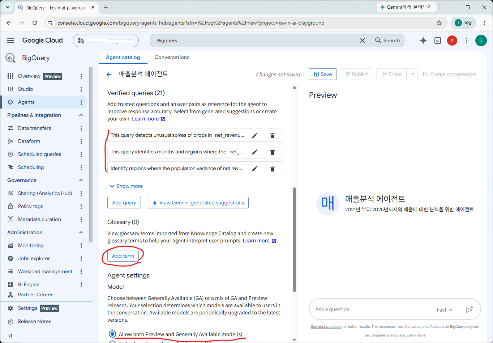

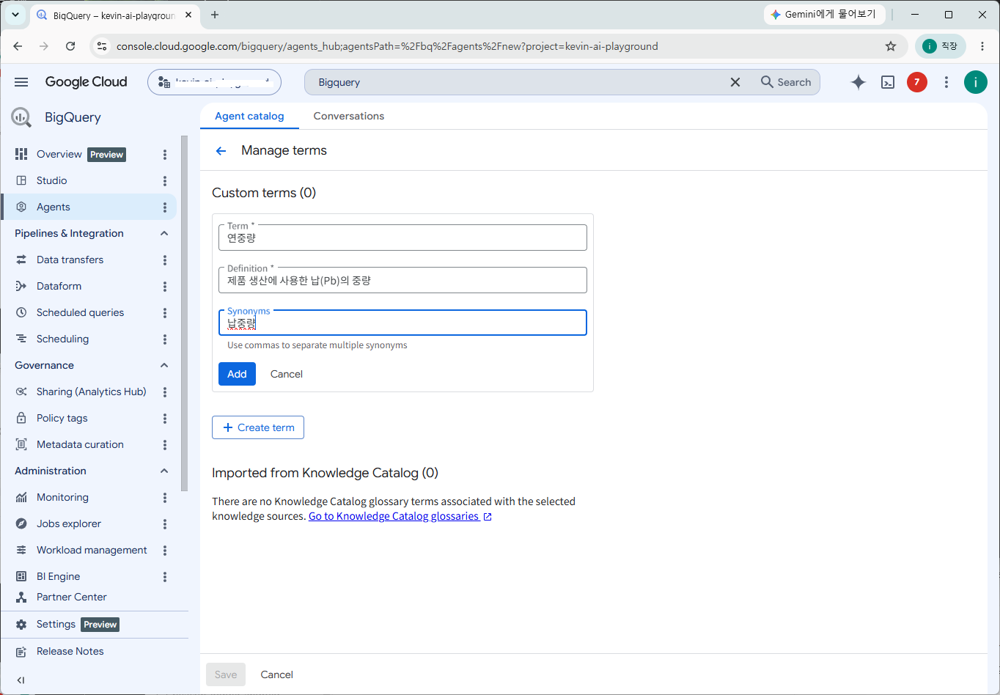

### 저장 및 Publish 

저장버튼을 눌러 저장하고 Publish 버튼을 눌러 "Publish Agent" 합니다. 

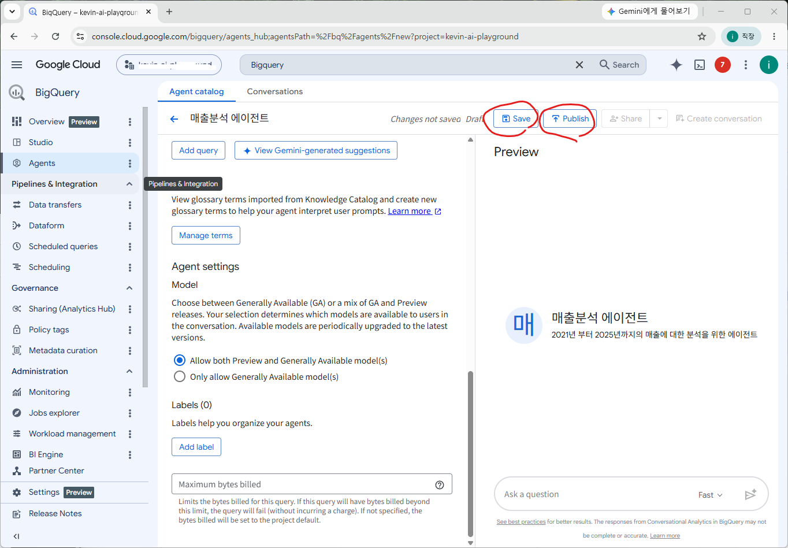


## 테스트 

적절한 문장을 입력하여 테스트 합니다. 추천 질문을 클릭해서 추가 분석을 해보세요. 예측 질문의 경우 BigQuery Machine Learning 모델이 실행되기 때문에 시간이 걸릴 수 있습니다. 

```
북미지역의 연도별 월매출을 조회해서 테이블과  Line chart 로 보여주세요
```

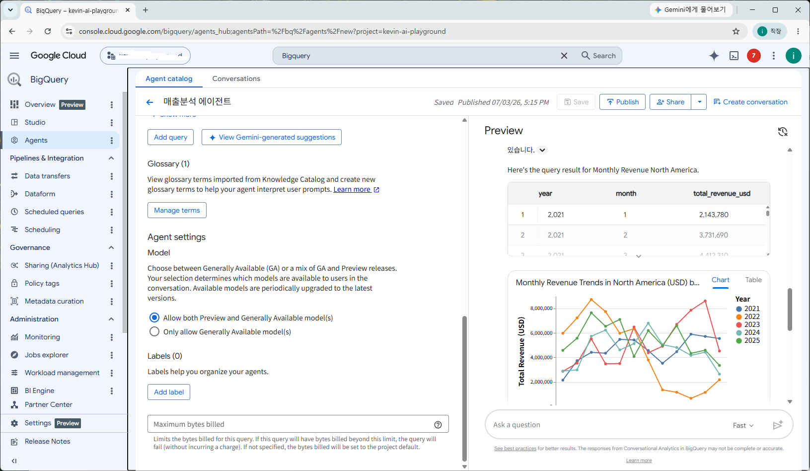

## 실습2 정리

작년만 해도 NL2SQL(Natural Language to SQL)이 잘 작동하지 않아서 대회형 분석의 구현이 어려웠습니다. 하지만 실습2에서 보신 것처럼 이제는 너무 쉽게 품질 좋은 대회형 데이터 분석 에이전트를 만들 수 있습니다. 여기서 중요한 것은 품질인데 품질은 높이기 위해 테이블 설명, 컬럼설명, Golden Query, 용어집 등의 Context를 정확히 AI에 제공하는 것입니다. 

다음 실습은 코드를 활용한 Agent를 만들어서 실습2에서 만든 에이전트를 사용하고 납 가격 정보를 인터넷 검색을 통해서 확보하여 조금 더 복합적인 분석을 하는 에이전트를 만들어보겠습니다. 

[다음 3 실습3 ADK 에이전트 만들기](./3%20실습3%20ADK%20에이전트%20만들기.md)