# ADK(Agent Development Kit) 에이전트 만들기 1

이제 Vibe Coding 으로 에이전트를 만들겠습니다. 우리가 만들 첫번째 에이전의 구조는 다음과 같습니다.

## 멀티에이전트 구조로 각 에이전트의 역할은 

 * Root Agent: Ochestration을 담당합니다. 사용자의 질문을 받아서 다른 Agent를 호출할지 결정하고 호출하고 답변을 수집하여 최종 답변을 생성합니다. 
 * 납 시세 검색 에에전트: 매출과 연관이 있는  납 시세를 Google Search를 통해서 검색합니다. 검색한 데이터를 분석에 활용 합니다. 

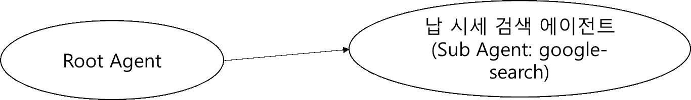

## 터미널에서 Google Cloud 로그인 (실습1에서 로그인 했으면 넘어가주세요)

Windows Terminal을 열어서 아래 2가지 명령을 **각각** 입력하여 Google Cloud에 로그인 합니다. 브라우저가 자동으로 열립니다. 

```
gcloud auth login
```

```
gcloud auth application-default login
```

```
gcloud config set project [Google Cloud 프로젝트 ID]
```

## Antigravity 2.0 프로젝트 생성 

Antigravity 2.0를 실행하고 Login 합니다. 아직 설치가 안되어 있다면 [0 사전준비](./0%20사전준비.md)의 내용을 보고 설치해주세요. 

로컬 PC에 **새폴더**를 만들고 지정하여 **adk-agent**이라는 이름으로 새 프로젝트를 만듭니다. **Security Settings** 는 Default 로 설정합니다. 

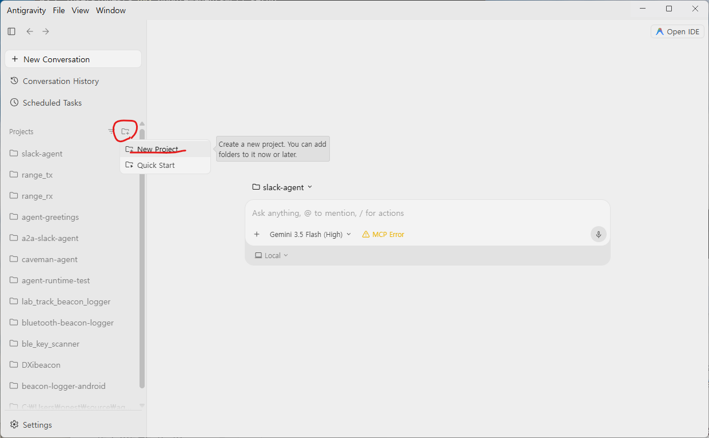

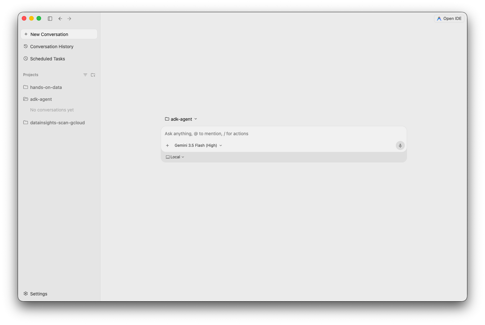

## Antigravity 2.0이 ADK 에이전트 코딩을 잘 할 수 있도록 Skills 추가

ADK 에이전트를 잘 만들기 위해 Skills 찾아서 설치해줍니다. Google 에서 ADK 에이전트 개발을 AI 도구로 개발을 잘 할 수 있도록 만든 [agents-cli](https://google.github.io/agents-cli/guide/getting-started/) 라는 도구가 있습니다. 

**Windows Terminal** 을 실행하고 아래 명령을 입력하여 설치합니다. 

```
uvx google-agents-cli setup
```

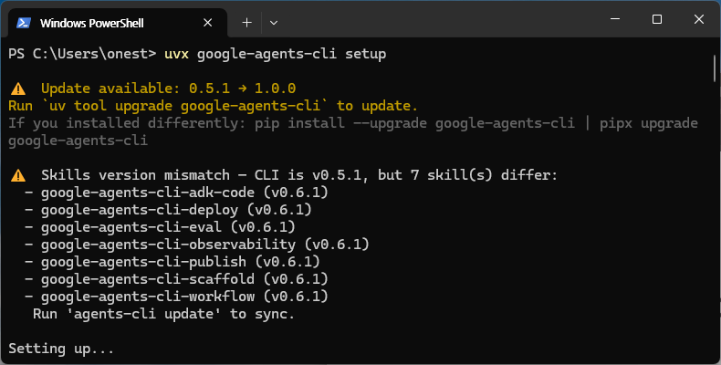

### .agents 폴더 생성 

새로 만든 프로젝트의 폴더를 탐색기로 열어서 ".agents" 폴더를 만듭니다. (폴더이름 앞에 dot 이 들어가 있습니다)

### 탐색기에서 skills 폴더 복사하여 프로젝트 폴더의 .agents 폴더 밑으로 복사

사용자마다 다른 폴더에 있습니다. C: 드라이브에서 "사용자" > [사용자아이디] > .agents 폴더를 찾으세요. 

skills 폴더를 복사 프로젝트 폴더의 .agnets 폴더 밑으로 복사합니다. 

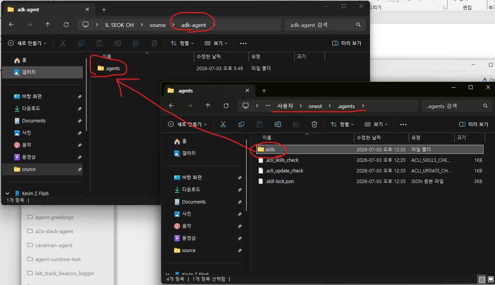

결과적으로 Antigravity 2.0 의 프로젝트 폴더에 .agents > Skills 폴더가 있습니다. 

### 확인 

Antigravit 2.0 에서 "Settings" 메뉴로 들어가서 "adk-agent" 프로젝트를 선택하고 customizations 항목에서 Skills 를 확인 합니다. 

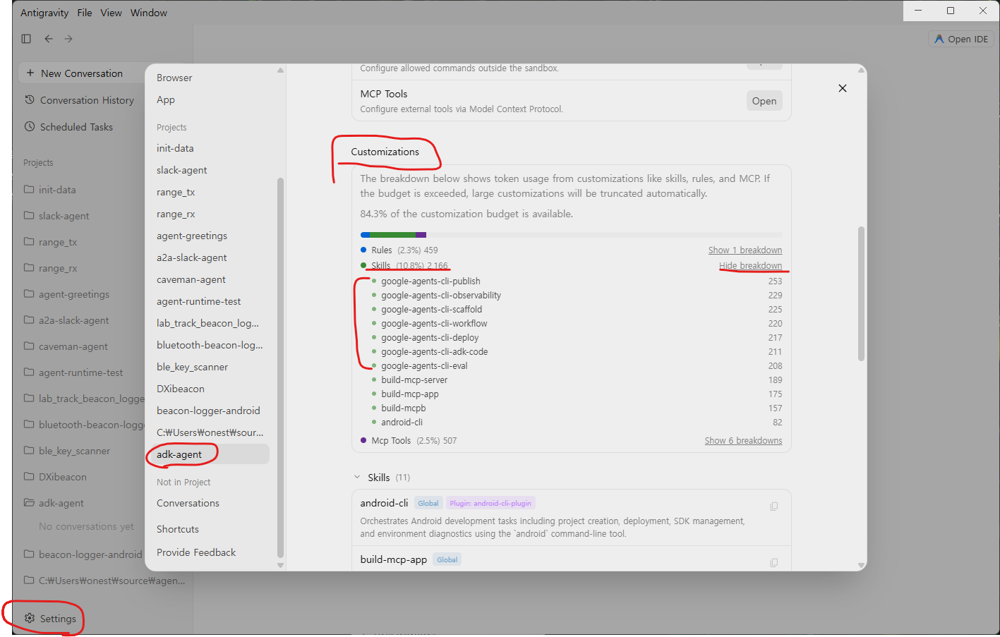

이제 ADK Agent를 만들 준비가 되었습니다. 

## 개발 기획문서 작성 

경험상 짧은 프롬프트로 시작하면 코드가 원하지 않는 방향으로 흘러가는 경우가 있습니다. 단순하게 "에이전트를 만들어줘"라고 하면 어떤 개발 도우과 프레임워크를 선택할지 알 수 없습니다. 어떤 언어를 선택할지 알 수 없습니다. 구조를 어떻게 만들지도 알 수 없습니다. 처음 만들 때 잘 만들면 고생을 덜 하게 됩니다. 

그래서 "개발 기획문서"를 작성하고 Agent 에게 그 문서를 바탕으로 시작하게 하는것이 좋습니다. 이 방법의 장점은 Vibe Coding 진행중에 너무 다른 방향으로 가버려서 고쳐쓸 수 없는 지경이 이르렀을 때 처음부터 다시 시작하기 좋습니다. 다시 시작할 때는 수정하면서 입력했던 명령을 기억하고 기획문서를 수정해줍니다. 

기획문서에는 이런 내용들이 포함되면 Antigravity가 헤메지 않습니다. 

1. 개발자 페르소나로 시작하고 에이전트의 목적을 명확히 기술합니다. 
1. 개발환경을 정확히 기술해줍니다. 개발을 위한 프레임워크(ADK), 개발언어(Python) 등 
1. 에이전트의 구조를 그림과 함께 명확히 기술해 줍니다. (위 내용 참조)
1. 사용자의 질문이 들어왔을 때 어떤 절차로 에이전트가 작동하는지에 대한 프로세스를 기술해줍니다. 순서대로 1,2,3... 번호를 붙여서 사람이 업무를 처리하는 순서를 기술해줍니다. 

지금 **Microsoft Word** 새문서를 열어서 시작합니다. 

이런형식입니다. 

```
납시세 조회 에이전트 개발 

에이전트의 개발 목적
당신은 AI 에이전트 개발자입니다. 
에이전트를 통해서 런던금속거래소(LME)의 납(Pb) 시세를 Google Search를 통해서 조회하는 에이전트를 개발하려고 합니다. 

에이전트 개발 환경 
 * Agent Framework: ADK 2.0 
 * agents-cli의 Skills를 사용
 * 개발언어: Python 3.14 
 * Deployment: Google Cloud Agent Runtime 
 * Session: InMemorySessionService
 * Memory: InMemoryMemoryService
 * Gemini Enterprise App에서 사용
 * Gemini 모델: gemini-3.5-flash


에이전트 구조 
 멀티에이전트 구조를 구현합니다. 
 ...
```

어떤식으로 문서를 작성할지 생각해보고 5분정도 **개발 기획 문서**를 Word 로 작성해 봅니다. 

<details>
<summary>예제 펼치기</summary>

### 에이전트 개발 기회문서 샘플

[에이전트 개발 기회문서 샘플](https://github.com/ilseokoh/antigravity-vibe-coding-hands-on/blob/main/docs/%EB%82%A9%EC%8B%9C%EC%84%B8%20%EC%A1%B0%ED%9A%8C%20%EC%97%90%EC%9D%B4%EC%A0%84%ED%8A%B8%20%EA%B0%9C%EB%B0%9C.pdf)

</details>

## 기획문서로 에이전트 코딩 

기획문서를 PDF로 저장합니다. Gemini 는 PDF를 더 좋아합니다. PDF 문서를 Antigravity 2.0 프로젝트 폴더에 docs 폴더를 만들어 복사해 둡니다. 

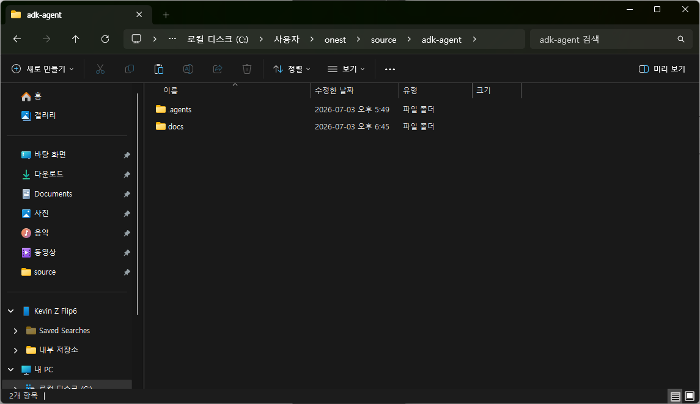

이제 Vibe Coding을 시작 합니다. 

```
docs/납시세 조회 에이전트 개발.pdf 문서는 에이전트 개발을 위한 기획 문서입니다. 
이 문서의 내용을 바탕을 ADK 에이전트를 개발해주세요. 
```

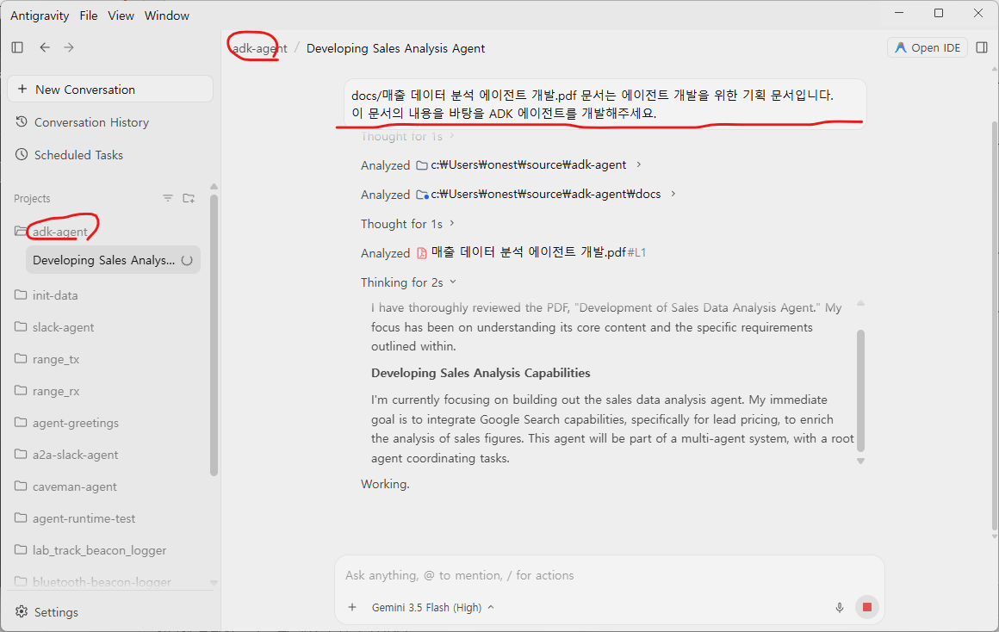

 * Antigravity 에 직접 입력할 때는 Shift + Enter 로 줄바꿈을 합니다. 
 * Antigravity 2.0은 먼저 Implementation Plan을 작성하기도 합니다. 
 * Plan을 확인하고 Preceed 시킵니다.
 * 무작정 Submit 버튼을 누르기 보다는 어떤작업을 하는지 실펴봅니다. 
 * 사용할 만한 Skills/Tools 를 찾기도 합니다. 
 * Antigravity 2.0 이 중간에 자주 확인을 요청할 수 있습니다. 적절한 Action을 취해주세요. 
 * Implementatio Plan을 보고 수정이 필요하면 수정합니다. 
 * 시간이 많이 걸리고 물어보는 것도 많습니다. 

 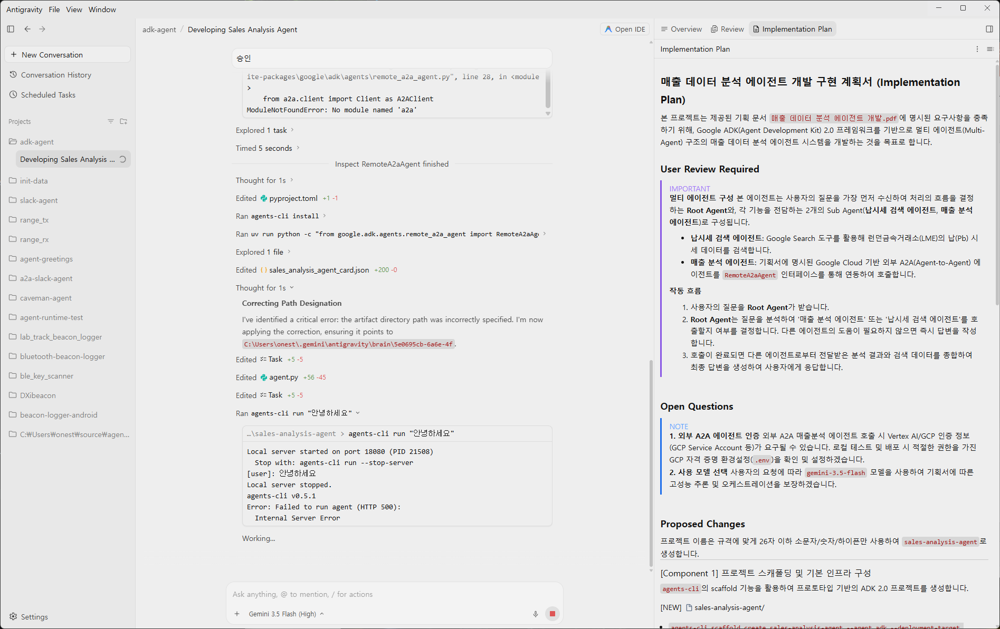

## 에이전트 테스트 

에이전트가 만들어졌나요? 
시간이 많이 걸리기도 하고 물어보는 것도 많습니다. 이제 테스트를 통해서 에이전트가 잘 작동하는지 확인해야 합니다. 

코딩 마지막 부분에 보통 테스트가 들어가 있습니다. ADK 는 로컬에서 테스트 할 수 있는 환경을 제공합니다. agents-cli playground 로 실행할 수 있습니다. 내가 이 명령을 몰라도 Antigravity에 "로컬에서 테스트 할 수 있도록 실행해줘"라고 하면 테스트 가능 합니다. 

```
로컬에서 테스트 할 수 있도록 실행해줘
```

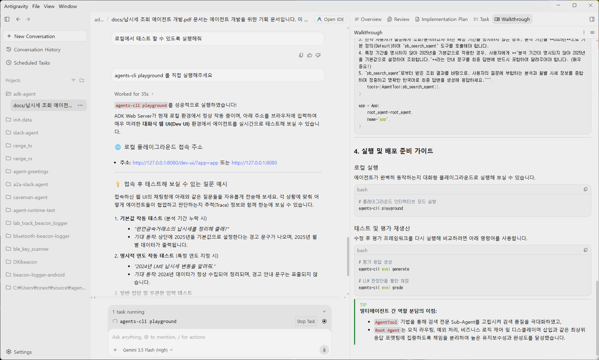

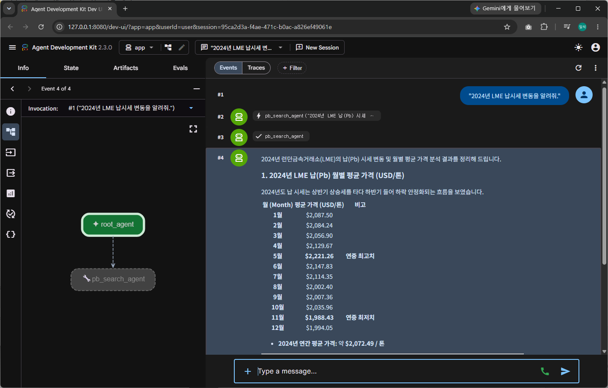


## 납시세 조회 에이전트 개발 정리 

Antigravity 2.0을 이용해서 ADK 에이전트를 개발했습니다. agents-cli 라는 적절한 도구를 설정했습니다. 개발 기획문서를 작성해서 큰 오류없이 에이전트 개발을 완료했습니다. 

다음은 이 실습2에서 만든 "매출 분석 에이전트"를 추가해서 종합적인 분석이 가능하도록 수정해보겠습니다. 

[다음 4 실습4 매출분석 에이전트 연동](./4%20실습4%20매출분석%20에이전트%20연동.md)
