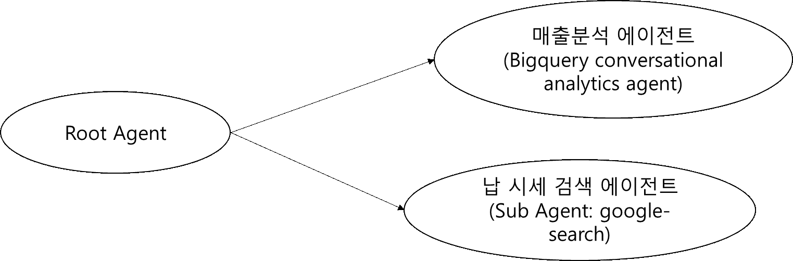

# ADK(Agent Development Kit) 에이전트 만들기 2

실습2에서 만든 에이전트를 추가하여 매출과 납시세 데이터를 이용해서 종합적인 분석이 가능하도록 수정해보겠습니다. 

최종 에이전트는 이런 모습입니다. 

## Antigravity 2.0 새로운 대화(세션) 추가 

새로운 기능을 추가하거나 기존 작업과 다른 작업을 시작할 때는 새로운 세션(대화)를 사용하는 것이 좋습니다. Antigravity 2.0은 세션의 내용을 유지하면서 실행되기 때문에 세션의 내용이 길어지면 오히려 작업 내용이 헷갈릴 수 있고 토큰 소모도 커질 수 있습니다. 

## "매출분석 에이전트" 추가 

다음 내용을 참고하여 Antigravity 2.0 에 추가 요청해주세요. 

 * BigQuery Conversational Analytics Agent 의 에이전트 이름 "매출분석 에이전트"를 명시
 * 최종 에이전트 이미지 

