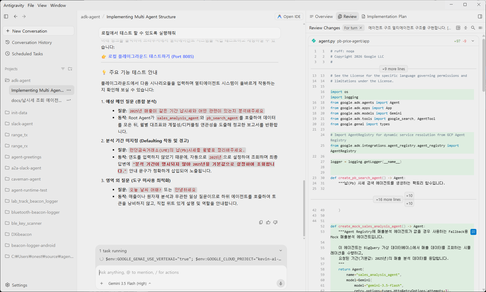
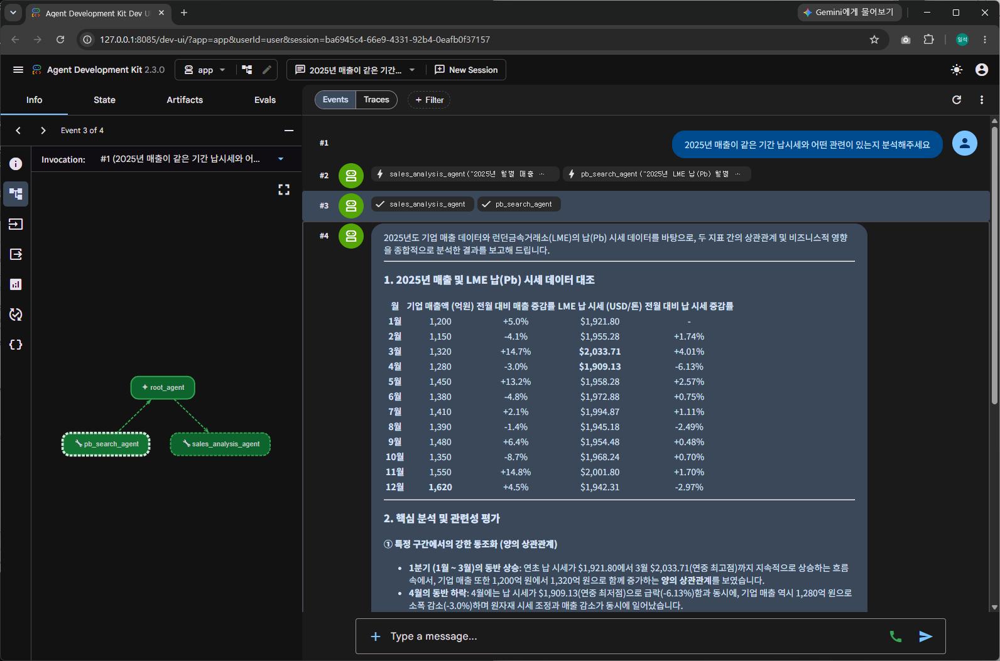

# ADK(Agent Development Kit) 에이전트 만들기 2

실습2에서 만든 에이전트를 추가하여 매출과 납시세 데이터를 이용해서 종합적인 분석이 가능하도록 수정해보겠습니다. 

최종 에이전트는 이런 모습입니다. 


## Antigravity 2.0 새로운 대화(세션) 추가 

새로운 기능을 추가하거나 기존 작업과 다른 작업을 시작할 때는 새로운 세션(대화)를 사용하는 것이 좋습니다. Antigravity 2.0은 세션의 내용을 유지하면서 실행되기 때문에 세션의 내용이 길어지면 오히려 작업 내용이 헷갈릴 수 있고 토큰 소모도 커질 수 있습니다. 


## "매출분석 에이전트" 추가 

다음 내용을 참고하여 Antigravity 2.0 에 추가 요청해주세요. 

 * BigQuery Conversational Analytics Agent 의 에이전트 이름 "매출분석 에이전트"를 명시
 * [최종 에이전트 이미지](https://github.com/ilseokoh/antigravity-vibe-coding-hands-on/blob/main/images/adk-multi-agent.png) 를 사용하면 좋습니다. 
 * 에이전트이 작동을 다시 설명합니다. 우리의 목표는 root 에이전트가 사용자 질문을 받아서 어떤 에이전트를 사용할지 판단하고 에이전트로부터 응답을 받아 최종 답변을 생성합니다. 
 * 각 에이전트의 역할을 설명합니다. 
 * 예상 질문도 추가해 봅니다. 

 프롬프트를 완성하여 Antigravity 2.0에 입력하여 실행합니다. 


 <details>
<summary>예제 펼치기</summary>

### "매출분석 에이전트" 추가

```
에이전트 구조 
멀티에이전트 구조를 구현합니다. 

[최종 에이전트 이미지](https://github.com/ilseokoh/antigravity-vibe-coding-hands-on/blob/main/images/adk-multi-agent.png)
 
 * Root Agent: 사용자 입력을 받습니다. 사용자의 질문에 필요하면 Sub Agent를 호출하여 결과를 받습니다. 모든 결과를 종합하여 최종 답변을 생성합니다. 
 * 납(Pb)시세 검색 에이전트: 런던금속거래소(LME)의 데이터를 Google Search 도구를 사용합니다. 
 * 매출 분석 에이전트: BigQuery Conversational Analytics Agent를 호출합니다. (에이전트 이름: 매출분석 에이전트)

에이전트 작동 설명 
1.	사용자의 입력은 Root Agent가 받습니다. 
2.	Root Agent 는 사용자의 질문을 분석하여 “매출 분석 에이전트” 또는 “납시세 검색 에이전트”를 호출해야 하는지 판단합니다. 만약 다른 에이전트의 도움이 필요없다면 바로 답변을 생성하여 응답합니다. 
    A.	“매출 분석 에이전트”의 호출이 필요하면 호출하여 결과를 받아옵니다. 
    B.	“납시세 검색 에이전트”의 호출이 필요하면 호출하여 결과를 받아옵니다. 
3.	Root Agent 는 다른 에이전트로부터 받아온 결과를 바탕을 최종 답변을 생성하여 사용자에게 응답합니다. 
4.	에이전트가 정확히 작동하기 위해서는 사용자로부터 분석을 위한 특정 기간을 받아야 하는데 만약 사용자가 기간을 명시하지 않으면 2025년을 기본값으로 정의하고 사용자에게 알립니다. 

예상질문
 * 2025년 매출이 같은 기간 납시세와 어떤 관련이 있는지 분석해주세요
```

</details>

## 에이전트 테스트 

로컬 테스트를 실행 합니다. 

```
로컬에서 테스트 할 수 있도록 실행해줘
```

두개의 에이전트를 모두 사용해야 하는 질문으로 테스트 해 봅니다. 
 * 2025년 납시세가 매출에 어떤 영향을 주었는지 분석해주세요. 
 * 2021년부터 2025년까지의 납시세와 매출정보를 바탕으로 납시세가 매출에 어떤 영향을 주었는지 분석해주세요. 





최종 목표였던 에이전트를 완성했습니다. 

[다음 실습5 Agent 배포하기 (Optional)](./5%20실습5%20Agent%20배포하기.md)
