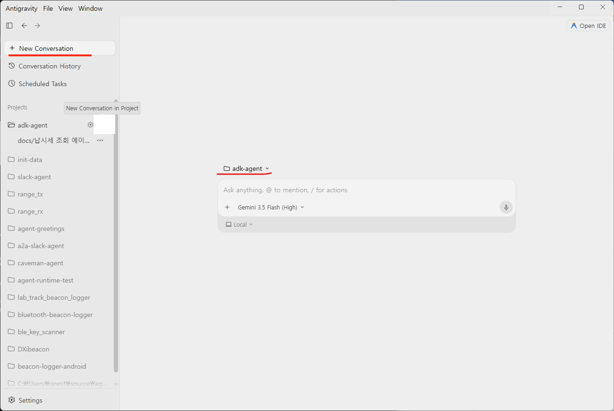
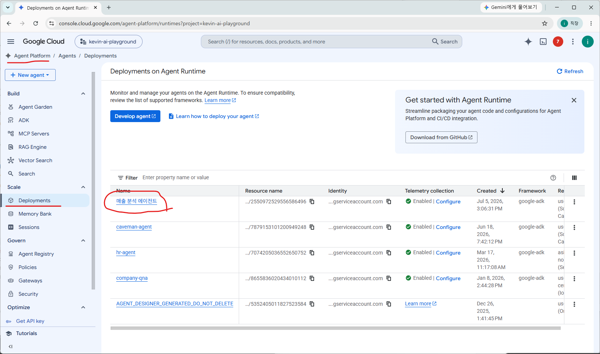
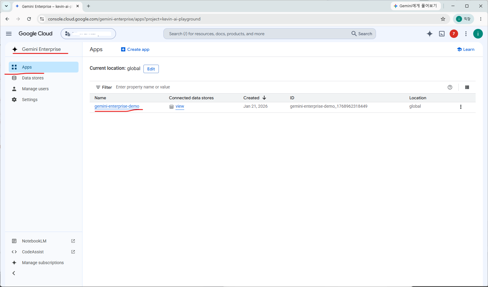
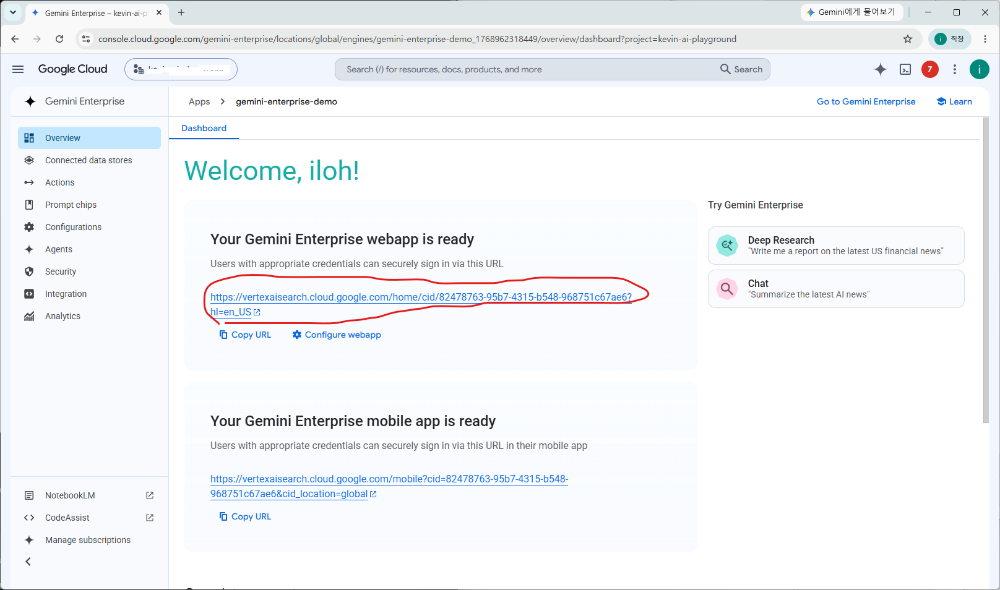
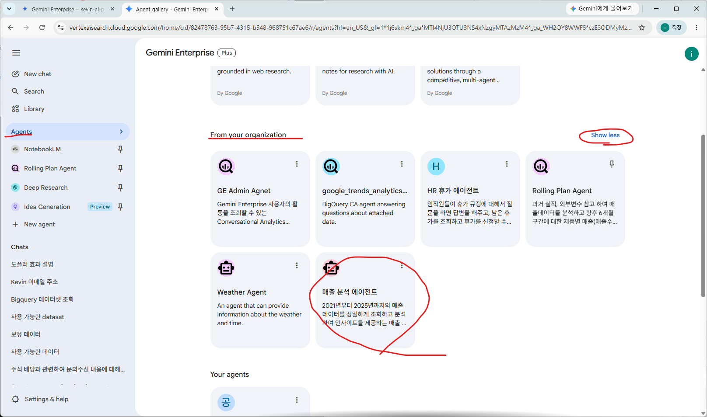
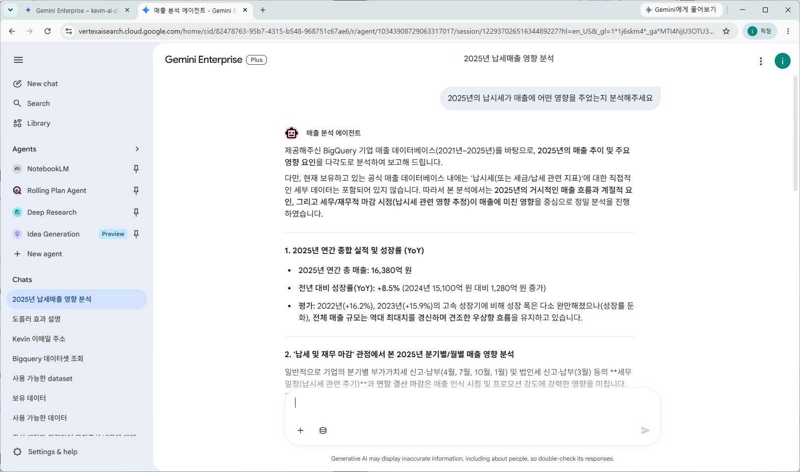

# Agent 배포 

개발을 완료한 Agent를 여러 사용자가 사용할 수 있도록 배포하겠습니다. 
Google Cloud에서는 Agent 배포를 3가지 방법을 추천합니다. 

1. Agent Runtime
1. Cloud Run
1. GKE(Google Kubernetes Engine)

이 중에서 우리는 Agent Runtime에 배포하고 Gemini Enterprise에서 사용할 수 있도록 배포해보겠습니다. 

## 새 대화(세션) 만들기 

배포는 개발과 다른 새로운 작업이므로 새 대화를 만들어 시작합니다. 



## 배포를 위한 프롬프트 

두단계로 배포하겠습니다. 1. Agent Runtime에 배포 2. Gemini Enterprise 에 연결

### Agent Runtime에 배포

```
Agent를 배포해주세요. 
에이전트의 설명을 더 자세히 기술해주세요. 

 * Deployment Target: Agent Runtime 
 * Agent name: sales-analytics-agent
 * Display name: 매출 분석 에이전트 
 * 설명: 2021년부터 2025년까지의 매출 데이터를 분석합니다. 
```

Google Cloud 콘솔에서 확인합니다. 




### Gemini Enterprise에 연결 

중간에 어떤 Gemini Enterprise에 연결할지 물어봅니다. 

```
배포된 Agent 를 Gemini Enterprise에서 사용할 수 있도록 등록해주세요
```

Google Cloud 콘솔에서 확인합니다. 







## Gemini Enterprise 에서 테스트

